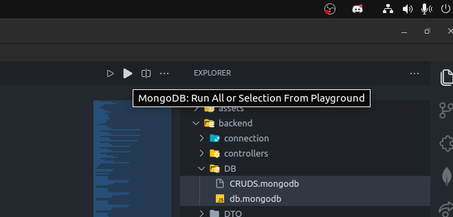

# Alquiler de Automoviles

El sistema de alquiler y gestión de reservas para autos es una solución optimizada basada en **Node.js, Express.js y MongoDB**, diseñada para mejorar la eficiencia de los procesos y ofrecer un servicio excepcional a los clientes.

## ÍNDICE

- [Generar la base de datos local o en tu servidor Mongo Cloud](#generar-la-base-de-datos-local-o-en-tu-servidor-mongo-cloud)
- [Configuración de las Variables de Entorno](#configuración-de-las-variables-de-entorno)
- [¿Cómo Utilizar el Software?](#cómo-utilizar-el-software)
- [Rutas](#rutas)
  - [Alquiler:](#alquiler)
  - [Automóviles](#automóviles)
  - [Clientes](#clientes)
  - [Empleados](#empleados)
  - [Reservas](#reservas)
  - [Sucursal Automóvil](#sucursal-automóvil)
- [Más Info](#más-info)
  - [Tecnologías Utilizadas](#tecnologías-utilizadas)
  - [Depencias](#dependencias)
  - [Contribuciones y licencia](#contribuciones-y-licencia)


<br>

## Generar la base de datos local o en tu servidor Mongo Cloud

> **Nota:** Para llevar a cabo estos pasos, primero hay que configurar las variables de entorno, más específicamente las de **URL**, a la tuya propia. Si no sabes como hacerlo, te recomendamos que revises la documentación oficial de mongodb, sobre como generar una cuenta en MongoDB y como utilizar los controladores para node.js. Aquí te dejamos los enlaces para acceder a la información: <br>
> [Mongodb](https://www.mongodb.com/docs/manual/) <br>
> [Mongodb En Node.js](https://www.mongodb.com/docs/drivers/node/current/) <br> <br>
> Para mayor entendimiento te recomendamos visitar la Universidad de mongo donde te instruyen completamente gratis y te certifican. [Mongodb University](https://learn.mongodb.com/)

<br>

Con esto en cuenta, vamos a proceder a generar nuestra base de datos.

Para ello necesitaremos instalar una sencilla extension en vscode y si estas en otros editores de codigo, busca alguna extension que sea similar a la que instalaremos

1. Instalar la extensión **MondoDB for VS Code** la cual es parte del sitio oficial de mongodb

2. Habiendo instalado la extensión, accederemos al archivo `db.mongodb` ubicado en la carpeta `DB`, seleccionaremos todo y daremos click donde se muestra en la siguiente imagen

   

   Bien hecho, ya tenemos nuestra base de datos gerada

## Configuración de las Variables de Entorno

Para personalizar el host y el puerto, sigue estos pasos:

1. Abre el archivo `.env`.

2. Asigna la base de datos que deseas usar en tu cuenta de [MongoDB](https://www.mongodb.com/es) a `ATLAS_USE`.

3. Ingresa la contraseña de tu base de datos en `ATLAS_PASSWORD`.

4. Define el nombre de tu base de datos en `ATLAS_DB`.

5. Asigna el **URL** generado por MongoDB a `URL_CONNECT`. Copia el código y pégalo en la variable de entorno.

6. Reemplaza `<password>` con tu contraseña.

**OPCIONAL:** La variable `SERVER_CONFIG` controla el host y el puerto. Puedes ajustarlos como prefieras. 
**Ejemplo:** SERVER_CONFIG = {"hostname": 127.01.01, "port": 3000}

¡Listo! Has configurado las variables de entorno.

Pero...

<hr>
<br>

## ¿Cómo Utilizar el Software?

Para instalar este software en tu servidor y utilizarlo localmente, necesitarás tener instalados los siguientes requisitos:

- Node.js
- Una cuenta en [MongoDB](https://www.mongodb.com/es)


Ahora que sabemos que el sistema puede funcionar en tu servidor, intentemos ejecutarlo siguiendo estos pasos:

1. Clona el repositorio: `https://github.com/JuanDavidAvilaRaveloCampus/mongoAlquiler.git`

2. Nos ubicamos en la carpeta `./backend`

    ```bash
    cd backend/
    ```

3. Desde la terminal, ve a la carpeta `backend` y instala las dependencias con el siguiente comando:

    ```bash
    npm update
    ```

4. Generamos los archivos que servirán de controladores:

    ```bash
    npm run tsc
    ```

    1. Una vez instaladas las dependencias vamos a abrir una nueva terminal y corremos el servidor estando ubicados en la carpeta `backend`, ejecutamos el software:


    ```bash
    npm run dev
    ```

5. En la consola, verás la URL base de tu servidor, por ejemplo: `http://localhost:3000`

    Si deseas cambiar el host y el puerto, consulta [este enlace](#¿cómo-configurar-el-host-y-el-puerto?)

    ¡Listo! Tu servidor está en funcionamiento.

<hr>
# Rutas

Ya tenemos corriendo nuestro servidor, pero ¿cómo ingresamos a la información almacenada en nuestra base de datos?. Pues aquí está la explicación de como ingresar a cada una de ellas:


## Alquiler:


- `http://[tu_host]:[tu_puerto]/alquiler/search=:id` 🔍: Sustituye `:id` por el identificador del alquiler que deseas obtener.

- `http://[tu_host]:[tu_puerto]/alquiler/search-estado=:sts` 📋: Sustituye `:sts` por el estado de los alquileres que deseas obtener, como Activo, Disponible o Inactivo. 

> **Nota:** La consulta debe comenzar con mayúscula.

- `http://[tu_host]:[tu_puerto]/alquiler/search-costo-total=:id` 💰: Acceso al costo total por alquiler.

- `http://[tu_host]:[tu_puerto]/alquiler/search-start_date=:inicio&end_date=:fin` 📅: Sustituye `:inicio` con la fecha de inicio y `:final` con la fecha de finalización del alquiler.

  **Formato de fecha:** AAAA-MM-DD
  **Ejemplo:** 2023-01-01

- `http://[tu_host]:[tu_puerto]/alquiler/search-fechas=Punto_12` ⏳: Busca alquileres que comiencen el **2023-08-01**. 
> **Nota:** Los parámetros no son dinámicos actualmente, pero se implementarán más adelante.

- `http://[tu_host]:[tu_puerto]/alquiler/search-cliente` 👤: Consulta a los clientes con al menos un alquiler.

<hr>
<br>

## Automóviles

- `http://[tu_host]:[tu_puerto]/automoviles` 🚘: Consulta todos los automóviles.
- `http://[tu_host]:[tu_puerto]/automoviles/disponibles` 🟢: Consulta automóviles disponibles. **Próximamente dinámico**.
- `http://[tu_host]:[tu_puerto]/automoviles/capacidad/qte=:id` 👥: Consulta autos con capacidad igual o mayor a `:id`.
- `http://[tu_host]:[tu_puerto]/automoviles/capacidad/lte=:id` 🙋‍♂️: Consulta autos con capacidad igual o menor a `:id`.
- `http://[tu_host]:[tu_puerto]/automoviles/modelo_marca` 🏁: Consulta automóviles ordenados por modelo y marca.

<br>

## Clientes

- `http://[tu_host]:[tu_puerto]/clientes` 🧑‍🤝‍🧑: Consulta a todos los clientes.

- `http://[tu_host]:[tu_puerto]/clientes/dni=:id` 🔑: Consulta cliente según `:id`.

- `http://[tu_host]:[tu_puerto]/clientes/alquiler` 📝: Consulta clientes con al menos un alquiler.

  <br>

## Empleados

- `http://[tu_host]:[tu_puerto]/empleados` 🕴️: Consulta empleados.

- `http://[tu_host]:[tu_puerto]/empleados/cargo=:cg` 👷: Consulta empleados por cargo, como Gerente, Supervisor, Asist

ente, Recepcionista y Vendedor.

<br>

## Reservas

- `http://[tu_host]:[tu_puerto]/reservas` 📆: Consulta todas las reservas.

- `http://[tu_host]:[tu_puerto]/reservas/estado=:sto` 📌: Consulta reservas por estado, como Pendiente o Disponible.

- `http://[tu_host]:[tu_puerto]/reservas/estado=:sto/cliente=:id` 📋🧑‍🤝‍🧑: Consulta reservas por estado y cliente. 

  `:sto`: Disponible o Pendiente.

  `:id`: Identificación del cliente.

<br>

## Sucursal Automóvil

- `http://[tu_host]:[tu_puerto]/sucursal-automovil`: Consulta relación entre sucursales y autos.

# 


# Más Info

<br>

## Tecnologías Utilizadas

- Node.js
- Expres.js
- MongoDB
- TypeScript

<br>

<hr>

## Dependencias

- [class-transformer](https://github.com/typestack/class-transformer) : Biblioteca que simplifica la transformación de objetos entre diferentes estructuras de datos, como objetos TypeScript y JSON
- [class-validator](https://github.com/typestack/class-validator) : Validación de objetos basada en decoradores en TypeScript y JavaScript
- [dotenv](https://www.npmjs.com/package/dotenv) : Biblioteca para cargar variables de entorno desde un archivo `.env` en el entorno de Node.js
- [express](https://expressjs.com/) : Un marco de aplicación web minimalista y flexible para Node.js que facilita la creación de aplicaciones web y APIs.
- [express-rate-limit](https://www.npmjs.com/package/express-rate-limit) : Un middleware para Express que implementa límites de velocidad y control de acceso basado en IP 
- [jose](https://github.com/panva/jose) : Una biblioteca que implementa los estándares JSON Web Token (JWT) y JSON Web Signature (JWS)
- [mongodb](https://www.npmjs.com/package/mongodb) : El controlador oficial de MongoDB para Node.js, que permite interactuar con bases de datos MongoDB
- [nodemon](https://www.npmjs.com/package/nodemon) : Una herramienta que monitoriza cambios en archivos y automáticamente  reinicia la aplicación Node.js para un flujo de desarrollo más eficiente
- [reflect-metadata](https://www.npmjs.com/package/reflect-metadata) :  Una librería que proporciona metadatos sobre tipos en tiempo de  ejecución. Se utiliza comúnmente con otras bibliotecas de TypeScript,  como `class-transformer` y `class-validator`,
- [typescript](https://www.typescriptlang.org/docs/) : lenguaje de programación que extiende JavaScript al agregar tipos  estáticos y otros características para el desarrollo más seguro y  estructurado

<br>

<hr>

### Contribuciones y licencia

¡Agradecemos tus contribuciones al proyecto! Si deseas colaborar, sigue los siguientes pasos:

1. Crea un nuevo "branch" para tus cambios.

   ```shell
   git checkout -b mi-nueva-funcionalidad    
   ```

2. Realiza tus modificaciones y mejoras.

3. Haz un "commit" de tus cambios.

   ```shell
   git commit -m "Agrego nueva funcionalidad"      
   ```

4. Envía tus cambios al repositorio remoto.

   ```shell
   git push origin mi-nueva-funcionalidad    
   ```

4. Abre un "**Pull Request**" en GitHub para que revisemos tus cambios.

Este proyecto se encuentra bajo la Licencia MIT. Siéntete  libre de utilizar, modificar y distribuir el código según tus  necesidades.

¡Gracias por contribuir al proyecto "mongoAlquiler"! 