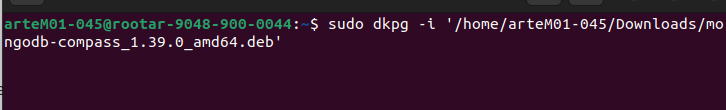
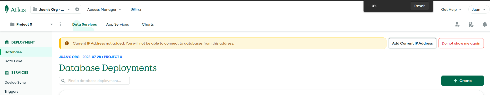
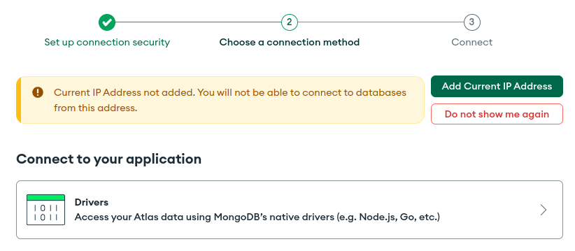
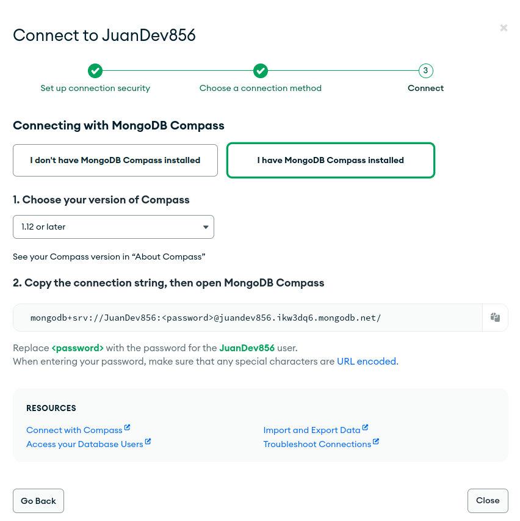
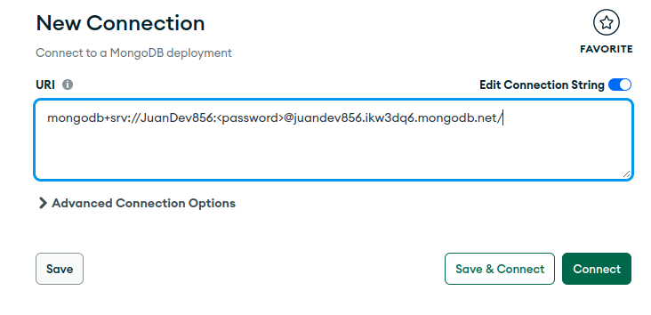

# MongoDB:leaves:

MongoDB es un gestor de bases de datos no relacionales o **NoSQL** orientado a documentos, utilizado para almacenar volúmenes masivos de datos. A diferencia de las bases de datos tradicionales basadas en SQL, MongoDB no se basa en tablas y columnas. 📚🌐

# NOTA: 
- Qué es un esquema en mongo 
- Como configurar la colección para que no rescriba los datos al llegar a la capacidad límite

## BJSON Y JSON  :memo:

BJSON (Binary JSON) es una extensión binaria de los archivos JSON. BSON también es una notación de objetos con estructura similar de pares clave-valor. Sin embargo, representa los datos en una forma binaria, lo que lo hace más eficiente para su almacenamiento y transferencia. BSON es ampliamente utilizado en bases de datos NoSQL, como MongoDB, para almacenar y recuperar datos de forma rápida y eficiente. A diferencia de JSON, BSON es binario y no legible por humanos, pero esto lo hace más adecuado para aplicaciones que requieren un alto rendimiento y un menor uso de recursos.

En resumen, JSON es una representación de datos legible por humanos y ampliamente utilizado en aplicaciones web y API's, mientras que BSON es una extensión binaria de JSON utilizada principalmente en bases de datos NoSQL para un almacenamiento eficiente.

<hr>


- # Menú:books::mortar_board:

  - [Manual de instalación 🛠️](#manual-de-instalación)
    - [Instalación de **MongoDB** :wrench:](#instalación-de-mongodb)
    - [Correr **MongoDB** :herb:](#correr-mongodb)
    - [Desinstalación de **MongoDB** 🗑️🚀](#desinstalación-de-mongodb)
  - [Instalación de **MongoDB Compass** 🔩](#instalación-de-mongodb-compass)
    - [Corrección de error de conexión con MongoDB Compass :bug:🔧](#corrección-de-error-de-conexión-con-mongodb-compass)
  - [Atlas 💡](#atlas)
    - [Creación de cuenta en Atlas :star::rocket:](#creación-de-cuenta-en-atlas)
  - [Creación de usuario](#creación-del-usuario) :sparkles:
  - [Conexión de tu cuenta Atlas con MongoDB Compass 🧭](#conexión-de-tu-cuenta-atlas-con-mongodb-compass)
  - [Comándos MongoDB Shell](#comándos-mongodb-shell)  :mag:
  - [Método CRUD y ejemplos](#método-crud)  :inbox_tray:
    - [Create](#create)
    - [Read](#read)
    - [Update](#update)
    - [Delete](#delete)
  - [Validaciónes con $jsonSchema](#validaciónes-con-$jsonSchema)   :closed_lock_with_key:
    - [Restricciones](#restricciones)
    - [Pasos para validar una colección](#pasos-para-validar-una-colección) :paperclip:
      -  [Crear una colección con validaciones ](#crear-una-colección-con-validaciones )
      - [Restricciones propierties](#restricciones-propierties)
      - [Confirme que la validación evita documentos no válidos](#confirme-que-la-validación-evita-documentos-no-válidos )
      - [Insertar un documento válido](#insertar-un-documento-válido)
      - [Consulta del documento válido ](#consulta-del-documento-válido )

  <br>
  <br>

# Manual de instalación

Herramientas a instalar    :wrench:

- MongoDB Shell

- MongoDB Compass

  

### Instalación de MongoDB

1. **Descargar MongoDB:** Ve al sitio web oficial de [MongoDB](https://www.mongodb.com/docs/manual/installation/) y descarga la versión adecuada para tu sistema operativo. 📥💻. Ten en cuenta que las versiones oficiales (**Enterprise Edition**) son versiones que tienen soporte técnico proporcionado por el equipo de MongoDB y otras características, sin embargo, es de pago. La otra opción es la versión de la comunidad (**Community Edition**), que son versiones de código abierto con características y funcionalidades básicas, pero no ofrecen un soporte oficial por parte de MongoDB, aunque la comunidad puede brindar ayuda.<br>

2. **Instalar MongoDB:** Sigue las instrucciones de instalación proporcionadas en el sitio web para instalar MongoDB en tu sistema. 🔧🚀<br>

3. **Configurar MongoDB:** Una vez instalado, es posible que debas configurar ciertos parámetros, como la ruta de almacenamiento de datos o el puerto de escucha. Puedes encontrar información detallada sobre la configuración en la documentación oficial de MongoDB. 📄⚙️<br>

4. **Iniciar el servidor:** Para iniciar el servidor de MongoDB, abre una terminal o línea de comandos y ejecuta el comando adecuado para tu sistema operativo. Por lo general, el comando es **"mongod"** o **"mongod.exe"**. 🚀🖥️<br>

5. **Interactuar con MongoDB:** Una vez que el servidor esté en funcionamiento, puedes interactuar con MongoDB a través de la línea de comandos o mediante herramientas de interfaz gráfica como **MongoDB Compass**. 💻🔍

¡Listo! Ahora tienes MongoDB instalado y listo para ser utilizado en tu sistema. 🎉🚀

<br>


### Si quieres saltarte toda la documentación, copia y pega los siguientes comandos en la terminal: **:clipboard: Nota:** Los siguientes comandos solo aplican para el sistema operativo Ubuntu 22.04 LTS : :clipboard: <br>

1. **Importar la clave pública utilizada por el sistema de gestión de paquetes**.

   ```bash
   sudo apt-get install gnupg curl
   ```

   ```bash
   curl -fsSL https://pgp.mongodb.com/server-6.0.asc | \
      sudo gpg -o /usr/share/keyrings/mongodb-server-6.0.gpg \
      --dearmor
   ```

2. **Crear un archivo de lista para MongoDB**

   ```bash
   sudo touch /etc/apt/sources.list.d/mongodb-org-6.0.list
   ```

   ```bash
   echo "deb [ arch=amd64,arm64 signed-by=/usr/share/keyrings/mongodb-server-6.0.gpg ] https://repo.mongodb.org/apt/ubuntu jammy/mongodb-org/6.0 multiverse" | sudo tee /etc/apt/sources.list.d/mongodb-org-6.0.list
   ```

3. **Recargar bases de datos de paquetes locales**

   ```bash
   sudo apt-get update
   ```

4. **Instalar los paquetes de MongoDB**

   ```bash
   sudo apt-get install -y mongodb-org
   ```

   ```bash
   echo "mongodb-org hold" | sudo dpkg --set-selections
   echo "mongodb-org-database hold" | sudo dpkg --set-selections
   echo "mongodb-org-server hold" | sudo dpkg --set-selections
   echo "mongodb-mongosh hold" | sudo dpkg --set-selections
   echo "mongodb-org-mongos hold" | sudo dpkg --set-selections
   echo "mongodb-org-tools hold" | sudo dpkg --set-selections
   ```

   <br>

## Correr MongoDB

1. **Iniciar MongoDB**<br>

   ```bash
   sudo systemctl start mongod
   ```

   ```bash
   sudo systemctl daemon-reload
   ```

2. **Verificar que MongoDB fue correctamente instalado.<br>**

   ```bash
   sudo systemctl status mongod
   ```

   ```bash
   sudo systemctl enable mongod
   ```

3. **Detener MongoDB<br>**

   ```bash
   sudo systemctl enable mongod
   ```

4. **Recargar MongoDB**<br>

   ```bash
   sudo systemctl restart mongod
   ```

5. **Empezar a usar MongoDB<br>**

   ```bash
   mongosh
   ```

   <br><br>

## Desinstalación de MongoDB

1. **Detener MongoDB<br>**

   ```bash
   sudo service mongod stop
   ```

2. **Remover Paquetes<br>**

   ```bash
   sudo apt-get purge mongodb-org*
   ```

3. **Remover los directorios de datos**<br>

   ```bash
   sudo rm -r /var/log/mongodb
   sudo rm -r /var/lib/mongodb
   ```

   <br><br>

## Instalación de **MongoDB Compass**

1. Accede al siguiente enlace: [MongoDB Compass](https://www.mongodb.com/products/compass)

2. Elige la última versión estable disponible.

3. En "Plataforma", selecciona la opción que corresponda a tu sistema operativo.

4. Descarga la aplicación.

5. Una vez descargado el archivo, accede a la carpeta de "Descargas" y arrastra el archivo recién descargado a la terminal para conocer la ruta del archivo.

6. En la terminal, ingresa el siguiente comando (**esto solo aplica para Ubuntu, para otros sistemas operativos consulta la documentación oficial**):

   ```bash
   sudo dpkg -i <nombre_del_archivo.deb>
   ```

   Debe verse de la siguiente forma:

   

7. Si el comando anterior muestra un error, ejecuta los siguientes comandos en orden:

   ```bash
   sudo apt --fix-broken install
   ```

   Este comando buscará las pre-dependencias necesarias para que la instalación sea exitosa.

   Luego, repite el paso 6.

¡Listo! Ahora has instalado **MongoDB Compass**. :tada:<br><br>

## Corrección de error de conexión con MongoDB Compass 

Si llegado el caso ocurre el siguiente error al darle click en **Connect** y la conexión es rechazada, sigue estos pasos:<br>

1. **Verifica la conexión**  :mag:

   ```bash
   service mongod status
   ```

2. **Activa la conexión**  :key:<br>

   ```bash
   sudo systemctl start mongod
   ```

3. **Vuelve al paso 1**. Si la conexión funciona, ¡felicidades! Si no, busca en la [documentación oficial de MongoDB](https://docs.mongodb.com/) o en la comunidad para obtener más ayuda. 🛠️🚀<br>

<br>
<br>

# Atlas

Atlas es un servicio de base de datos en la nube. Permite alojar y administrar bases de datos sin la necesidad de configurar y mantener la infraestructura de servidores.

### Características ✨🌱

- Facilidad de uso

- Escalabilidad

- Alta disponibilidad 

- Seguridad

- Localizaciones globales

- Integraciones

- Automatización

- Tarificación flexible

  <br>

## Creación de cuenta en Atlas

1. Accede al siguiente enlace: [MongoDB Compass](https://www.mongodb.com/products/compass) 🌐🔍

2. Elige la última versión estable disponible. 🚀🌟

3. En "Plataforma", selecciona la opción que corresponda a tu sistema operativo. ⚙️🖥️

4. Descarga la aplicación. 📥💻

5. Una vez descargado el archivo, accede a la carpeta de "Descargas" y arrastra el archivo recién descargado a la terminal para conocer la ruta del archivo. 📂🖱️

6. En la terminal, ingresa el siguiente comando (**esto solo aplica para Ubuntu, para otros sistemas operativos consulta la documentación oficial**):

   ```bash
   sudo dpkg -i <nombre_del_archivo.deb>
   ```

   Debe verse de la siguiente forma:

    🛣️🖼️

7. Si el comando anterior muestra un error, ejecuta los siguientes comandos en orden:

   ```bash
   sudo apt --fix-broken install
   ```

   Este comando buscará las pre-dependencias necesarias para que la instalación sea exitosa.

   Luego, repite el paso 6. 🔄🔧

¡Listo! Ahora has instalado **MongoDB Compass**. 🎉🎉🎉


<br>

<br>

# Creación del Usuario

1. Ir a la [página oficial](https://www.mongodb.com) 🌐

2. Iniciar sesión con **Atlas** 🔑

3. Click en el logo de atlas:

    

4. Click en **New Proyect** 🆕

5. Asignamos el nombre del proyecto y damos click en **next** 🏷️

6. Es opcional agregar permisos para miembros, pero para este ejemplo, nos saltaremos ese paso dándole click en **Create Proyect** 🤝

7. Click en **Build a Database** 🏗️

8. Seleccionamos el proveedor y la región a gusto 

9. Nombramos nuestro **Cluster**.

   :mega: **NOTA:** No se puede cambiar el nombre del grupo luego de ser creado ❗

10. Click en **Create** 🆕

11. Asignamos un nombre y contraseña.

    :anger: **LA CONTRASEÑA NO PUEDE TENER SÍMBOLOS** :anger: 🔐🚫❗

12. Click en **Create User** 👤

13. Click en **Finish and Close** 🚪

14. Click en **Go to DataBases** 📚

Listo, tu Base de datos fue instalada correctamente. 🎉

Para conectarte desde tu **MongoDB Compass**, realizaremos de nuevo el paso de [Conexión](#conexión-de-tu-cuenta-atlas-con-mongodb-compass) 🔗🔍


## Asignar permisos de administrador

Para ello, sigue los siguientes pasos:

1. Inicia sesión en MongoDB Atlas 

2. Haz click en el menú izquierdo en el apartado de seguridad, específicamente donde dice **Database Access**:

    

3. Click en **EDIT** ✏️

    

4. Ubícate en **Build and Role** 🛠️

    

5. Click en **Atlas Admin** 👑

6. Ve al final del apartado y da click en **Update User** 🔄

Listo, ya hemos asignado permisos de administrador a un usuario. Ahora el usuario tiene privilegios de administrador en MongoDB Atlas. :white_check_mark:

<br>

<br>

## Conexión de tu cuenta Atlas con MongoDB Compass

1. En tu navegador, inicia sesión con tu cuenta Atlas en la página oficial de MongoDB.

2. Accede a la opción Database. 🌐

   

3. Accede a la opción de Compass. 🔍

   

4. Selecciona todas las opciones que cumplan tus parámetros y sigue los pasos.

5. Copia el punto 2 de la siguiente imagen:

   

6. Pega el punto 3 en la aplicación de **MongoDB Compass**. 🔑

   

7. Cambia **<password>** por tu contraseña.

8. **Opcional:** Darle click en **FAVORITE** y asignarle un color. 🌈

9. Activa la conexión dándole click en **Connect**. 🚀

1. <br>

   <br>


###  :heavy_exclamation_mark: Llegado el caso de que ocurra algún error de conexión realizar los siguientes pasos:heavy_exclamation_mark: 

1. Ubícate en el navbar lateral y ve a las opciones de seguridad (**Security**).

2. Click en **Network Access**.

3. Click en **EDIT**. 🔒 El objetivo de este paso es darle permiso a todas las IP para que tengan acceso a la base de datos siempre.

   

4. Click en **ADD CURRENT IIP ADDRESS** 🌐

   Listo, ahora te podrás conectar desde cualquier lugar del mundo solo con tu cuenta de **Atlas**. 🌎

   <br><br>

   

# Comándos MongoDB Shell

Los siguientes comandos aplican tanto para la terminal como para **MongoDB** Compass

- `db` : Muestra la base de datos que estás usando. 📌
- `db.createCollection("<nombre_de_la_colección>")`  : Crea una colección. 👨‍💻
- `show databases`  o  `show dbs`: Muestra todas las bases de datos que tengan mínimo una colección dentro, si no hay, no la muestra. 👀
- `use <database>`: Accede a la base de datos especificada y si no existe la crea. 👉
- `db.<collection>.insertOne()`: Inserción simple de documentos. [Ejemplo](#inserción-simple-de-documentos) 📝
- `db.<collection>.insertMany()` : Inserción de multiples documentos. [Ejemplo](#inserción-múltiple-de-documentos) 📚
- `db.<collection>.find()` : Retorna todos los documentos de la colección especificada. [Ejemplo](#lectura-de-todos-los-documentos-de-una-colección) 📄
- `db.<collection>.find( { "field": "value" } )` : Selecciona todos los documentos siempre y cuando `field` sea igual a `value` . [Ejemplo](#lectura-de-datos-por-condición-de-igualdad) 🔑
- `db.<collection>.updateOne()` : Actualiza un documento simple. [Ejemplo](#actualizar-un-documento-simple) ✏️
- `db.<collection>.updateMany()`  : Actualiza multiples documentos [Ejemplo](#actualizar-múltiples-documentos) 📋
- `db.<collection>.replaceOne()` : Remplaza un documento [Ejemplo](#remplazar-un-documento) 🔄
- `db.<collection>.deleteOne()` : Elimina un documento [Ejemplo](#eliminar-solo-un-documentos-que-coincida-con-la-condición) 🗑️
- `db.<collection>.deleteMany()`  : Elimina todos los documentos de una colección  [Ejemplo](#eliminar-todos-los-documentos-de-una-colección) ❌

<br><br>

# Método CRUD

### CREATE

- #### **Inserción simple de documentos.**

  Inserta documentos simples en una colección. Si el documento no especifica un camapo `_id` , mongo crea uno que haga referencia a ese documento. :inbox_tray:

  ```bash
  use sample_mflix           
  db.movies.insertOne(
    {
      title: "The Favourite",
      genres: [ "Drama", "History" ],
      runtime: 121,
      rated: "R",
      year: 2018,
      directors: [ "Yorgos Lanthimos" ],
      cast: [ "Olivia Colman", "Emma Stone", "Rachel Weisz" ],
      type: "movie"
    }
  )
  ```


- #### Inserción múltiple de documentos.

  Inserta multiples documentos dentro de una colección contenidos por un array y separados por comas. Al igual que la inserción simple, si no se especifíca un campo `_id`, MongoDB  lo agrega. :page_facing_up:

  ```bash
  use sample_mflix
  
  db.movies.insertMany([
     {
        title: "Jurassic World: Fallen Kingdom",
        genres: [ "Action", "Sci-Fi" ],
        runtime: 130,
        rated: "PG-13",
        year: 2018,
        directors: [ "J. A. Bayona" ],
        cast: [ "Chris Pratt", "Bryce Dallas Howard", "Rafe Spall" ],
        type: "movie"
      },
      {
        title: "Tag",
        genres: [ "Comedy", "Action" ],
        runtime: 105,
        rated: "R",
        year: 2018,
        directors: [ "Jeff Tomsic" ],
        cast: [ "Annabelle Wallis", "Jeremy Renner", "Jon Hamm" ],
        type: "movie"
      }
  ])
  ```

### READ:

- #### **Lectura de todos los documentos de una colección**

  Retorna todos los documentos de la colección especificada. en este caso `db.movies` :clinking_glasses:

  ```shell
  use sample_mflix
  db.movies.find()
  ```

  Esta operación es igual en SQL a: 

  ```sql
  SELECT * FROM movies
  ```


- #### Lectura de datos por condición de igualdad

  Retorna todas las `movies`cuando `title`sega igual a `Titanic`

  ```shell
  use sample_mflix
  
  db.movies.find( { "title": "Titanic" } )
  ```

  Equivalente en SQL a:

  ```sql
  SELECT * FROM movies WHERE title = "Titanic"
  ```


### UPDATE:

- #### Actualizar un documento simple

  Actualiza el primer documento encontrado en la colleción cuando `title` es igual a `Twiligth`

  ```bash
  use sample_mflix
  
  db.movies.updateOne( { title: "Twilight" },
  {
    $set: {
      plot: "A teenage girl risks everything–including her life–when she falls in love with a vampire."
    },
    $currentDate: { lastUpdated: true }
  })
  ```

  - Usamos el operador `$set` para actualizar el valor del campo `plot` para la pelicula `Twilight`
  - Usamos el operador `$currentDate` para actulizar el valor del campo `lastUpdated` para la fecha actual. Si el campo `lastUpdated` no existe. `$currentDate` creará el campo.


- #### Actualizar múltiples documentos

  Actualiza todos los documentos de la colección cuando `security_deposit` es menor a `100`

  ```bash
  use sample_airbnb
  
  db.listingsAndReviews.updateMany(
    { security_deposit: { $lt: 100 } },
    {
      $set: { security_deposit: 100, minimum_nights: 1 }
    }
  )
  ```

  El operador `$set` actualiza el valor del campo `security_deposit`  a `100` y el valor del campo `minimun_nights` a `1`. 

- #### Remplazar un documento

  Remplaza el primer documento de la colección cuando `account_id: 371138` 

  ```bash
  db.accounts.replaceOne(
    { account_id: 371138 },
    { account_id: 893421, limit: 5000, products: [ "Investment", "Brokerage" ] }
  )
  ```

  Para leerlo puedes utilizar `findOne` como en el ejemplo:

  ```bash
  db.accounts.findOne( { account_id: 893421 } )
  ```


### DELETE:

- #### Eliminar todos los documentos de una colección

  Para eliminar todos los documentos de una colección, basta con pasar el parámetro de `deleteMany()`  vacío.

  ```bash
  use sample_mflix
  
  db.movies.deleteMany({})
  ```


- #### Eliminar todos los documentos que cumplan con la condición

  Para eliminar todos los documentos de la colección cuando `title`  sea igual a `"Titanic"` 

  ```bash
  use sample_mflix
  
  db.movies.deleteMany( { title: "Titanic" } )
  ```


- #### Eliminar solo un documentos que cumpla con la condición

  Elimina el primer documento que coincida con la condición

  ```bash
  use sample_mflix
  
  db.movies.deleteOne( { cast: "Brad Pitt" } )
  ```

  <br>

# Validaciónes con $jsonSchema

Esquema Json es un vocabulario que le permite anotar y validar documentos JSON. Puede usar el esquema JSON para especificar las reglas de validación para los campus en un formato legible para humanos. 📄👀

### Restricciones

No puedes especificar un esquema de validación para:

- Colecciones en las bases de datos admin,  local y  config

<br>

## Pasos para validar una colección

1. ### Crear una colección con validaciones 

   Crear una colección estudiantes y usar el operador $jsonSchema  para establecer las reglas del esquema de validación. 🏗️🧱

   ```javascript
   db.createCollection("students", {
      validator: {
         $jsonSchema: {
            bsonType: "object",
            title: "Student Object Validation",
            required: [ "address", "major", "name", "year" ],
            properties: {
               name: {
                  bsonType: "string",
                  description: "'name' must be a string and is required"
               },
               year: {
                  bsonType: "int",
                  minimum: 2017,
                  maximum: 3017,
                  description: "'year' must be an integer in [ 2017, 3017 ] and is required"
               },
               gpa: {
                  bsonType: [ "double" ],
                  description: "'gpa' must be a double if the field exists"
               }
            }
         }
      }
   } )
   ```

   - db.createCollection('tu-coleccion') : Crea la colección, en la cual vamos a trabajar.

   - validator : Se utiliza para validar la colección, y asegurar que los documentos insertados cumplan las reglas y restricciones configuradas.

   - $jsonSchema : Es el operador que especifica que trabajaremos con datos del tipo JSON.

   - bsonType : Especifica que los documentos deben ser de tipo objeto (Objetos BSON).

   - title : Título descriptivo para el esquema de validación tipo JSON.

   - required : Indica los campos que son obligatorios para la inserción del documento.

   - properties : Define las propiedades y restricciones que deben tener los campos del documento.

   En properties incluiremos todos los campos que necesitemos validar, se incluirán como objetos y tendrán varios valores los cuales definirán las restricciones de ese campo en específico.

   Estas son algunas de las restricciones que nos podemos encontrar en esos campos:

   <br>

   ### Restricciones propierties 

   1. bsonType: Especifica el tipo de dato esperado para la propiedad.

   2. required: Indica que la propiedad es obligatoria y debe estar presente en el documento.

   3. minimum: Establece el valor mínimo permitido para la propiedad numérica.

   4. maximum: Establece el valor máximo permitido para la propiedad numérica.

   5. minLength: Define la longitud mínima permitida para una cadena de caracteres.

   6. maxLength: Define la longitud máxima permitida para una cadena de caracteres.

   7. enum: Especifica un conjunto de valores válidos que puede tener la propiedad.

   8. pattern: Define una expresión regular que la propiedad debe cumplir.

   9. description: Proporciona una descripción o comentario sobre la propiedad.

   10. format: Define un formato específico que debe cumplir la propiedad (por ejemplo, "date-time" para fechas y horas en formato ISO 8601).

   11. multipleOf: Especifica el múltiplo en el que un número debe estar.

   12. minItems: Establece el número mínimo de elementos requeridos para una matriz.

   13. maxItems: Establece el número máximo de elementos permitidos para una matriz.
   
   14. uniqueItems: Indica si los elementos de una matriz deben ser únicos entre sí.

<br>

2. ### Confirme que la validación evita documentos no válidos 

   La siguiente operación inserta falla porque gpa es un integer (número entero) cuando el validator requiere un double (número flotante de doble precisión, como por ejemplo: 3.1416). 🛑🚫

   ```javascript
   db.students.insertOne( {
      name: "Alice",
      year: Int32( 2019 ),
      major: "History",
      gpa: Int32(3),
      address: {
         city: "NYC",
         street: "33rd Street"
      }
   } )
   ```

   La operación retorna el error: 

   ```
   MongoServerError: Document failed validation
   ```

<br>

3. ### Insertar un documento válido 

   La inserción tiene éxito luego de cambiar el tipo del valor del campo gpa a double. 🎉🙌

   ```javascript
   db.students.insertOne( {
      name: "Alice",
      year: NumberInt(2019),
      major: "History",
      gpa: Double(3.0),
      address: {
         city: "NYC",
         street: "33rd Street"
      }
   } )
   ```

   <br>

4. ### Consulta del documento válido 

   Para confirmar que el documento ha sido insertado satisfactoriamente, consulta la colección de students. 🧐🔍

   ```javascript
   db.students.find()
   ```

   MongoDB retorna el documento insertado:

   ```javascript
   [
     {
       _id: ObjectId("62bb413014b92d148400f7a5"),
       name: 'Alice',
       year: 2019,
       major: 'History',
       gpa: 3,
       address: { city: 'NYC', street: '33rd Street' }
     }
   ]
   ```

   

